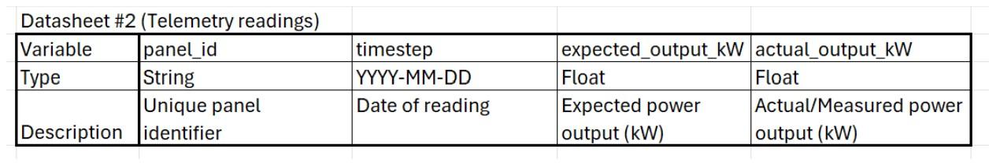
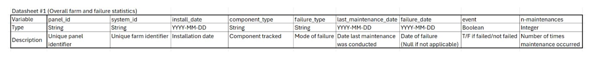

# 🎱 Team Ate — Six Sigma Hackathon  

👥 **Group Members:** Mehali Desai · Andrew Lin · Adhyan Prasad · Jennie Redrovan · Aleira Sanchez

---

## 💡 Our Tool: Solar Panel Quality Control & Reliability System  

### 📝 Introduction  
This repository provides a **data analysis and visualization tool** designed to address the following prompt:

> *Utility-scale solar power plants are found all throughout New York State, due to significant promotion policies over the last decade. Utility-scale solar can be made up of hundreds or even thousands of solar panels, each of which requires routine maintenance. Your team has been commissioned by the New York State Energy Research & Development Authority (NYSERDA), whose staff hope to better understand the lifespan remaining for existing utility-scale solar farms. Design a quality control system to track and mitigate solar panel failure.*

This project builds a **quality control and reliability assessment framework for solar panels**, combining **statistical process control**, **failure analysis**, and **lifespan modeling**.

---

## 🎯 Scope  
As consulting analysts for the **New York State Energy Research & Development Authority (NYSERDA)**, our goal is to design and demonstrate a **data-driven quality control system** that can:

-  Monitor the performance and degradation of solar panels over time  
-  Identify common sources of failure  
-  Estimate remaining useful life of panels  
-  Support cost-based decision-making between repair and replacement  

---

## 🧩 Core Objectives  

1.  **Generate Control Charts:** Track solar panel efficiency over time using Statistical Process Control (SPC).  
2.  **Identify Failure Modes:** Categorize and visualize the most common causes of panel failure.  
3.  **Analyze Lifespan Distributions:** Fit and visualize lifespan data (CDF, PDF, and Survival Probability).  
4.  **Perform Cost Analysis:** Compare cumulative repair vs. replacement costs to guide decisions.  
5.  **Integrate All Outputs:** Compile visualizations and analytics into a final report for NYSERDA stakeholders.  

---

## 👥 Intended Users  
-  **NYSERDA staff:** Seeking data-driven insights into solar panel performance and longevity.  
-  **Consulting analysts:** Maintaining or expanding the quality control and reporting framework.  

---

## ⚙️ Code Walkthrough  

The following steps walk through the [`runMe.R`](./R/runMe.R) script, which is a tutorial that reproduces the analysis and generates the final report.  

1.  **Generate the Dataset**  
   Upload your datasheet (in the same format as the provided codebook)  
      - To generate sample data, run [`make_datasheet.R`](./R/make_datasheet.R).
      - If you are providing numbers for maintenance costs, change the varaibles outlined in [`runMe.R`](./R/runMe.R) to reflect your cost per panel

2.  **Generate Control Charts**  
   Run [`SPC.R`](./R/SPC.R) to create control charts showing panel efficiency trends.  

3.  **Visualize Failure Types**  
   Run [`Bargraph.R`](./R/Bargraph.R) to generate a bar plot of failure frequencies and types.  

4.  **Run Core Statistics Function**  
   Execute [`statistics.R`](./R/statistics.R) to calculate summary statistics and plot lifespan distributions (CDF, PDF, survival).

5. **Run Costs Function**  
   Execute [`cost_function2.R`](./R/cost_function2.R) to calculate the total costs per panel including maintenance effort.

6.  **Compile All Results**  
   Use [`pdf_function.R`](./R/pdf_function.R) to merge all outputs into an organized HTML report.  

7.  **Export Final HTML Report**  
   Return to [`generate_report.R`](./R/generate_report.R) and run the final code block to generate your comprehensive report. [`generate_report.R`](./R/generate_report.R) generates your HTML file.  
   The final HTML file will appear in your project folder.

---

## 📕 Codebook  

    
    

---

## 🥽 Function Descriptions  

[`make_datasheet.R`](./R/make_datasheet.R):
Name: make_datasheet
Title: make_datasheet
Description: Two functions that creates panel life information and telemetry for one farm 
Author: group8
Params: farm_id, mean_life, sd_life, fail_type_probs, maint_delay_mean, farm_df, farm_id, # deg_rate, irr_factor_range, noise_range

[`SPC.R`](./R/SPC.R): 
Name: StatisticalProcessTest 
Title: SPC
Description: Function to create a control chart of average efficiency 
Author: group8
Params: input1 = actual power, input 2 = expected power, input3 = timestep.

[`Bargraph.R`](./R/Bargraph.R):
Name: Bargraph
Title: Bargraph
Description: Generate a bar graph of the different failure types
Author: Group 8
Params: input (numeric) vector of 1 or more numeric values.

[`statistics.R`](./R/statistics.R):
Name: statistics
Title: statistics 
Description: A function that takes in data and creates a reliability analysis
Author: group8
Params: csv_path, install_col, failure_col, horizons

[`cost_function2.R`](./R/cost_function2.R):
Name: cost_function2
Title: cost_function2
Description: Function to plot the amount of maintenance and total cost per panel
Author: group8
Params: data, issue_costs, issue_col, id_col, install_col, routine_cost_per_visit,  #schedule_years, as_of 

[`pdf_function.R`](./R/pdf_function.R):
Name: pdf_function
Title: pdf_function
Description: Gathers all the graph and data we generated
Author: Group 8, PhD
Params: vector or graphs variables from previously used functions

[`generate_report.R`](./R/generate_report.R)
Name: generate_solar_report
Title: generate_solar_report
Description: Function to generate a website with our graphs and data analysis
Author: group8
Params: stats, bar_plot, var_plot, output_file

---

## 📦 Output  

The final deliverable is a **comprehensive HTML report** that includes:  
-  Control chart for efficiency monitoring  
-  Lifespan distribution and survival probability analysis  
-  Failure frequency visualization  
-  Cost analysis insights  
-  Key takeaways and recommendations for NYSERDA  

---

## 📚 Sources  

In developing this tool, we referenced:  
-  **ChatGPT** (for code and documentation refinement)  
-  **Tim Fraser’s Online Textbook** (for statistical foundations)  
